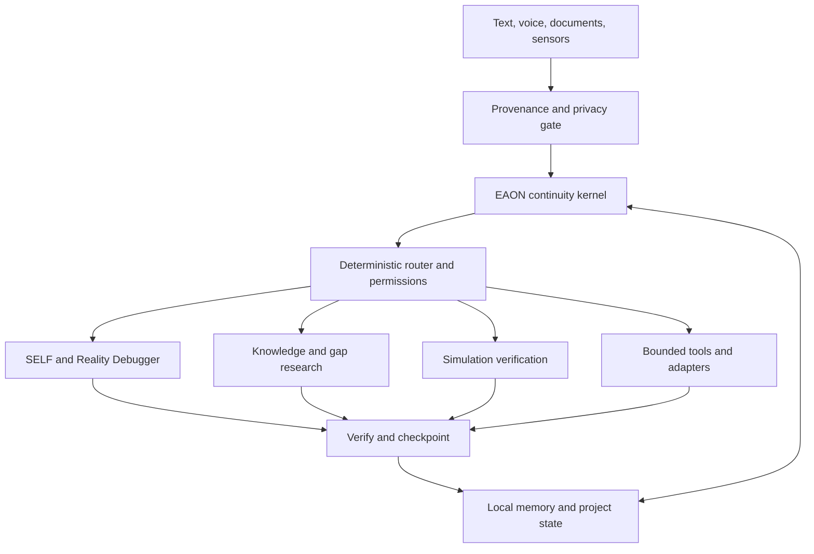

# EAON architecture and integration boundary

## What is connected today

| Entrypoint | Current path | Storage/output |
|---|---|---|
| Root `main.py` | IP enrichment → risk mode → keyword route → exact-ID inference gateway → Ollama → audit/optional notifications | Logs/cache |
| Genesis CLI | Classify → retrieve → reality labels → deterministic council → append | Hash-linked JSONL |
| Local-first CLI | Local source → evidence → SQLite → retrieval → extractive/Ollama → reality check | SQLite sources/claims/runs |
| Cognitive Twin API | Request → domain-label policy → journal/graph/hypothesis/snapshot operations | PostgreSQL |
| Voice harness | Manifest → mock/command → metrics → State Journal | JSON + JSONL |
| MetaBench | Seeded cases → model/mock → parse → score → reports | JSON/HTML |
| BHIDT adapter | Journal validation → fingerprint → recompute → compare → evidence report | Manifest/checkpoint/journal/report |

The launcher isolates packages. It does not create a shared bus or translate
memory formats. The research detector and ingestion database also need integration.

## Target architecture

This is a **design target**, not implemented wiring:

## Proposed shared contracts

| Contract | Minimum information |
|---|---|
| Input | ID, timestamp, project, source, authority, privacy class, raw-content reference |
| Memory reference | ID, source, timestamp, epistemic state, confidence, supersedes/conflicts |
| Task | Goal, expected output, budget, dependencies, allowed tools, stop conditions |
| Tool request | Tool/version, typed arguments, authorization evidence, dry-run, idempotency key |
| Tool result | Status, artifact references, error, elapsed time, source hashes |
| Checkpoint | Active goal, pending tasks, decisions, unknowns, memory references, journal head |

These are integration proposals. Existing modules keep their original models until
an explicit migration and compatibility test is written.

## Boundaries carried forward

1. Local persistent state is authoritative; missing context remains unknown.
2. Retrieved content is data, not permission to invoke a tool.
3. Deterministic evidence processing precedes model synthesis.
4. Personal cognitive data is separate from professional/domain datasets.
5. Models are replaceable; EAON owns orchestration, not the compute vendor.
6. Cloud execution is an explicit configured route with a privacy boundary.
7. Verification returns evidence; explanation must not invent the underlying state.
8. Each journal has one writer until concurrency control is implemented.

## Integration order

Use Genesis SELF as the inspectable nucleus. Add continuity state/checkpoints,
expose local-first evidence retrieval through an adapter, then attach BHIDT and
the research graph. Keep speech and physical tools behind the later interlock.
